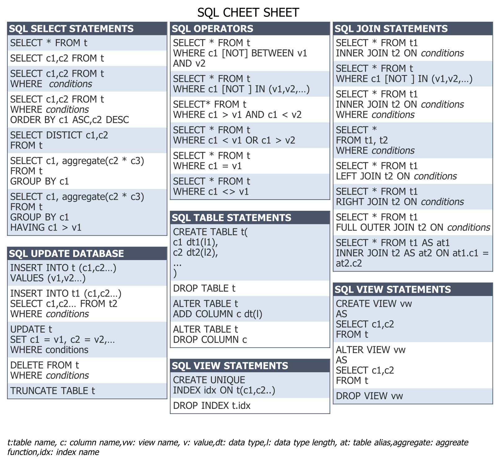
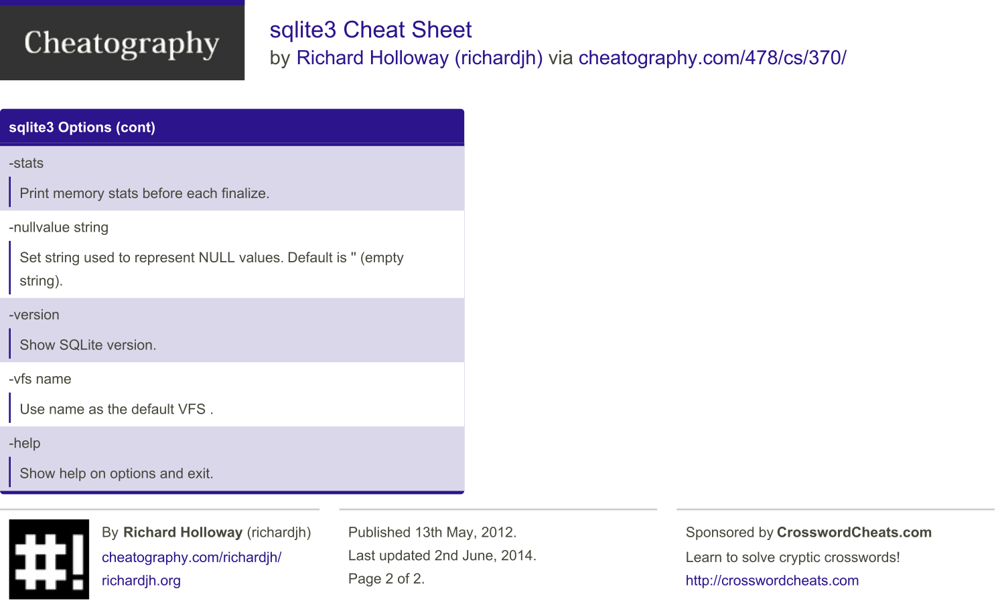
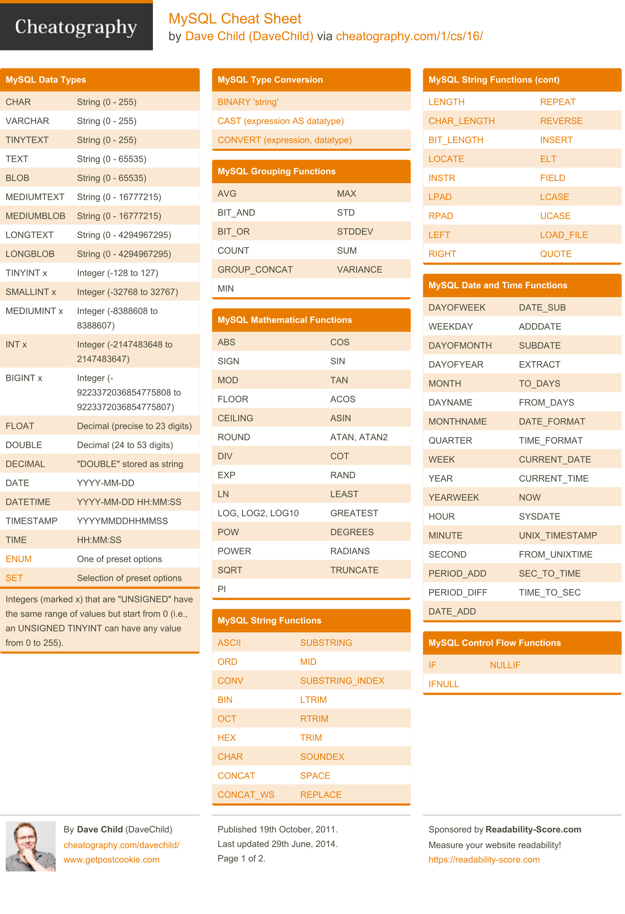
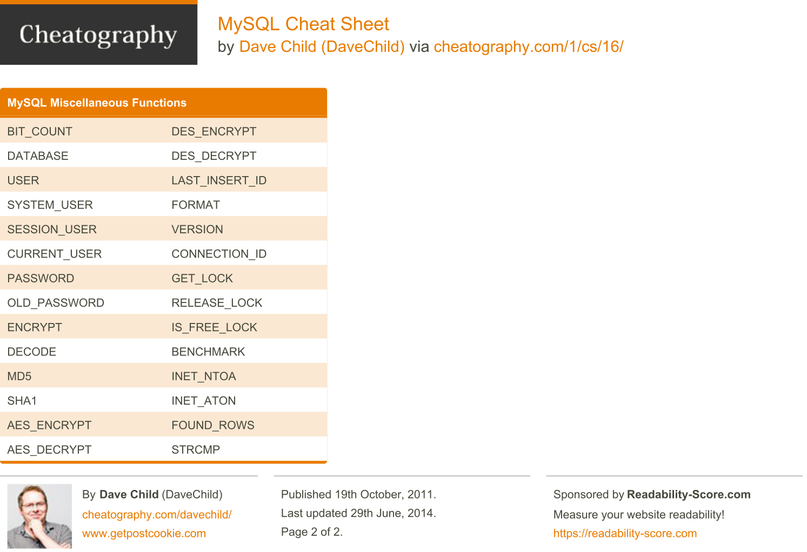
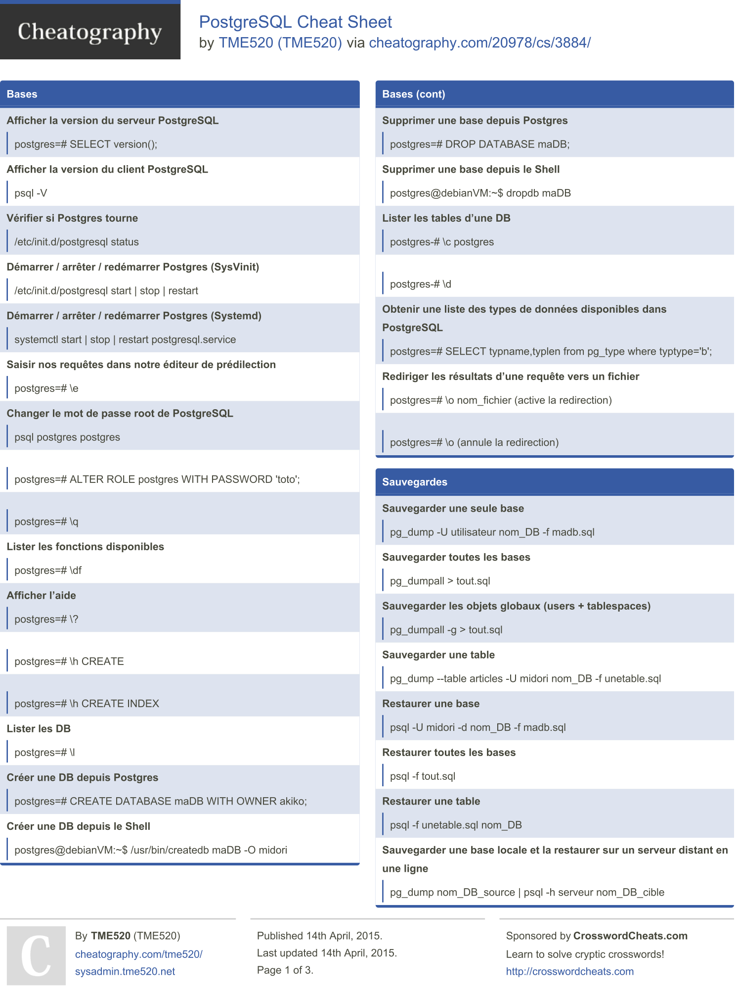

<!--
---

[TOC]
-->
---

**Foreword**

Cheat sheets.

---

# SQL

- [SQL](zt_sql_cheat_sheet.pdf). PDF. [See the notes below](#sql-notes).

<center>

</center>

- [SQL](SQL-Cheatsheet-2.pdf). PDF.

<center>

</center>

# SQL notes

## Basic Queries

```sql
SELECT col1, col2, col3, ... FROM table1;
```

- Commands are not case-sensitive: `SELECT` or `select`;
- `;` is not required;
- Dividing an integer by an integer gives an integer; use floats with decimals.

## Add conditions

```sql
SELECT col1 FROM table1
WHERE (col4 = "A") AND (col5 = "B" OR col6 = "C");
```

```sql
SELECT col1 FROM table1
WHERE (col4 BETWEEN 10 AND 20);
```

  - `< > = <> <= >= AND OR`.

## Filter out missing values (or non-missing values)

```sql
SELECT col1 FROM table1
WHERE col4 IS NULL;
```

```sql
SELECT col1 FROM table1
WHERE col4 IS NOT NULL;
```

## Set limits

```sql
SELECT col1 FROM table1
WHERE (col4 BETWEEN 10 AND 20)
LIMIT 3;
```

- `BETWEEN` is inclusive (like `<=` and `>=`);

## Find patterns

```sql
SELECT col1 FROM table1
WHERE col4 LIKE 'a%';
```

- regex patterns like `'a%'` for "begins with a", `"%B"` for "ends with capital B";
- `%` is a joker.

```sql
SELECT col1 FROM table1
WHERE col4 IN ('Germany', "France", 'UK');
```

- `IN` subgroups, limited to a set.

## Command hierarchy

```sql
SELECT col1, col2, col3, ... FROM table1
WHERE col4 = 1 AND col5 = 2
LIMIT 3
GROUP by ...
HAVING count(*) > 1
ORDER BY col2, col3 DESC;
```

- `DESC` or ascending by default.

## Aggregate (two ways)

Opening aggregation:

```sql
SELECT COUNT(col1) FROM table1;
```

- `COUNT` (not missing or not null values), `SUM`, `AVG`, `MIN`, `MAX`.

Closing aggregation:

```sql
SELECT col1 FROM table1
HAVING count(col2) > 1;
```
- `count`, `sum`, `avg`, `min`, `max`.

## Unique values

```sql
SELECT DISTINCT col2 FROM table1;
```

```sql
SELECT COUNT(col1) COUNT(DISTINCT col2) FROM table1;
```

## Compute, transform, create new columns

```sql
SELECT col1 + col2 AS col1b FROM table1;
```

- `+ - * /`.

## Add views

```sql
CREATE VIEW view1 AS V1
SELECT col1 FROM table1;
```

- Aliases for the headers.

# SQLite

- [SQLite](richardjh_sqlite3.pdf). PDF.

<center>



</center>

# MySQL

- [MySQL](davechild_mysql.pdf). PDF.

<center>



</center>

---

- [Essential MySQL](guslong_essential-mysql.pdf). PDF.

<center>


</center>

---

- [Essential Admin for MySQL](4107-rc029-010d-essential-admin-mysql5.5_2.pdf). PDF only.

# PostgreSQL

- [PostgreSQL](tme520_postgresql.pdf). PDF.

<center>



</center>

---

- [PostgreSQL Interactive Terminal Commands](squixy_postgresql-interactive-terminal-commands.pdf). PDF.

<center>

</center>

---

- [Essential PostgreSQL](52492-rc071_postgresql_2.pdf). PDF only.

# NoSQL

- [NoSQL and Data Scalability](4154-rc105-010d-nosql.pdf). PDF only.
- [MongoDB](4176-rc171-010d-mongodb-2.pdf). PDF only.
