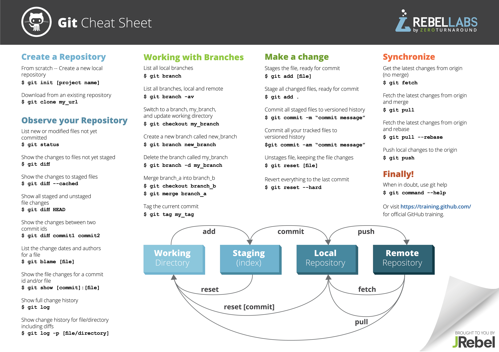

---

[TOC]

---

**Foreword**

Cheat sheets.

---

## HTML

- [HTML Markups](kesavanbr_html-cheatsheet.pdf).
- [HTML Basics](domdomdom_html-basics.pdf).
- [Core HTML](4254-rc064-010d-core_html_1.pdf).
- [HTML Character Entities 1](davechild_html-character-entities.pdf).
- [HTML Character Entities 2](reverseemf_html-character-entities.pdf).
- [HTML5 Quick Reference](html5-cheat-sheet.pdf).

### IMG

---

---

## CSS

- [CSS Basics](kvzhuang_miiicasa-css-cheat-sheet.pdf).
- [Blueprint CSS](blueprintcss-1-0-1-cheatsheet-4-4-gjms).

### IMG

---

---

## Web Programming

- [Web Programming](sanoj_web-programming.pdf).
- [HTTP Status Code 1](ebeth31415_http-status-code-definitions.pdf)
- [HTTP Status Code 2](kstep_http-status-codes.pdf).

### IMG

---

---

## Git

- [Git](git-cheat-sheet.pdf)
- [GitHub Git](github-git-cheat-sheet.pdf)

### IMG

---

---

---

### Principal commands

- `git init`: creates a new Git repository.
- `git status`: inspects the contents of the working directory and staging area.
- `git add <filename_1> <filename_2>`: adds files from the working directory to the staging area.
- `git add .`, `git add --all`.
- `git diff <filename_1> <filename_2>`: shows the difference between the working directory and the staging area.
- `git commit -m "<comments>"`: permanently stores file changes from the staging area in the repository.
- `git log`: shows a lis t of all previous commits.
- `git show HEAD`: show the most recent commit.
- `git checkout HEAD <filename_1> <filename_2>`: discards changes in the working directory.
- `git checkout <filename_1> <filename_2>`: idem.
- `git reset HEAD <filename_1> <filename_2>`: unstages file changes in the staging area, restore the file in your working directory.
- `git reset <SHA> (7 characters)`: can be used to reset to a previous commit in your commit history.
- `git branch`: lists all a Git project's branches.
- `git branch <branch_name>`: creates a new branch.
- `git checkout <branch_name>`: used to switch from one branch to another (the branch_name).
- `git merge <branch_name>`: used to join file changes from one branch to another (your in branch A, you merge branch_name with A).
- `git branch -d <branch_name>`: deletes the branch specified.
- `git clone <remote_location> <clone_name>`: creates a local copy of a remote.
- `git remote -v`: lists a Git project's remotes.
- `git fetch`: fetches work from the remote into the local copy (no merging).
- `git merge origin/master`: Merges origin/master into your local branch.
- `git push origin <branch_name>`: pushes a local branch to the origin remote.

## Project Management

- [Scrum](Scrum.pdf).

### IMG

---

---